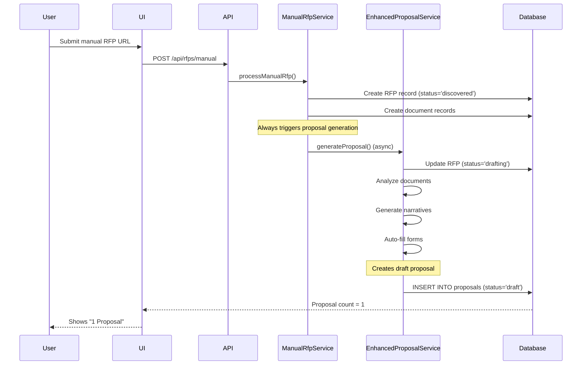

# Database Schema Analysis: Dual Proposal Creation Issue

**Date**: November 5, 2025
**Issue**: Draft proposals are automatically created during manual RFP submission
**Status**: Root cause identified in proposal creation workflow

---

## Executive Summary

The RFP Agent platform creates duplicate/minimal proposals because the manual RFP processing workflow **always** triggers proposal generation, creating a draft proposal record even when the user hasn't requested one. This is by design in the current implementation but creates confusion in the UI where "1 Proposal" appears immediately after RFP submission.

---

## 1. Proposals Table Schema

### Complete Table Structure

```sql
CREATE TABLE proposals (
  -- Primary Key
  id VARCHAR PRIMARY KEY DEFAULT gen_random_uuid(),

  -- Foreign Keys & Relationships
  rfp_id VARCHAR NOT NULL REFERENCES rfps(id),

  -- Proposal Content (JSONB fields)
  content JSONB,                    -- Main proposal content
  narratives JSONB,                 -- AI-generated narrative sections
  pricing_tables JSONB,             -- Pricing breakdown
  forms JSONB,                      -- Filled form data
  attachments JSONB,                -- File references
  proposal_data JSONB,              -- Structured metadata

  -- Financial Fields
  estimated_cost DECIMAL(12, 2),
  estimated_margin DECIMAL(5, 2),

  -- Status & Tracking
  status TEXT NOT NULL DEFAULT 'draft',  -- draft, in_progress, ready_for_review, submitted, awarded, rejected, withdrawn
  receipt_data JSONB,                    -- Submission confirmation details
  submitted_at TIMESTAMP,

  -- Timestamps
  generated_at TIMESTAMP NOT NULL DEFAULT NOW(),
  updated_at TIMESTAMP NOT NULL DEFAULT NOW()
);

-- Indexes
CREATE INDEX idx_proposals_proposal_data_gin USING gin(proposal_data);
CREATE INDEX idx_proposals_narratives_gin USING gin(narratives);
```

### Key Fields Explained

| Field | Type | Purpose | Default |
|-------|------|---------|---------|
| `id` | VARCHAR (UUID) | Unique proposal identifier | `gen_random_uuid()` |
| `rfp_id` | VARCHAR | Links to parent RFP (REQUIRED, NOT NULL) | - |
| `content` | JSONB | Complete proposal document structure | `{}` (empty object) |
| `narratives` | JSONB | AI-generated sections (exec summary, technical approach, qualifications) | `{}` |
| `pricing_tables` | JSONB | Pricing breakdown and cost estimates | `{}` |
| `forms` | JSONB | Auto-filled form field data | `{}` |
| `attachments` | JSONB | References to uploaded supporting documents | `{}` |
| `proposal_data` | JSONB | Metadata (generation settings, AI model used, quality scores) | `{}` |
| `estimated_cost` | DECIMAL(12,2) | Total proposal cost estimate | NULL |
| `estimated_margin` | DECIMAL(5,2) | Profit margin percentage | NULL |
| `status` | TEXT (enum) | Workflow status | `'draft'` |
| `receipt_data` | JSONB | Submission confirmation from portal | NULL |
| `submitted_at` | TIMESTAMP | When proposal was submitted | NULL |
| `generated_at` | TIMESTAMP | When proposal was created | `NOW()` |
| `updated_at` | TIMESTAMP | Last modification timestamp | `NOW()` |

---

## 2. Proposal-RFP Relationship

### Database Constraints

```typescript
// From shared/schema.ts
export const proposals = pgTable('proposals', {
  id: varchar('id').primaryKey().default(sql`gen_random_uuid()`),
  rfpId: varchar('rfp_id')
    .references(() => rfps.id)    // Foreign key constraint
    .notNull(),                    // REQUIRED - cannot be null
  // ... other fields
});

// Drizzle ORM Relationships
export const proposalsRelations = relations(proposals, ({ one }) => ({
  rfp: one(rfps, {
    fields: [proposals.rfpId],
    references: [rfps.id],
  }),
}));

export const rfpsRelations = relations(rfps, ({ many }) => ({
  proposals: many(proposals),  // One RFP can have MULTIPLE proposals
}));
```

### Relationship Characteristics

- **Cardinality**: One-to-Many (1 RFP → N Proposals)
- **Constraint**: `proposals.rfp_id` is NOT NULL and has FK constraint to `rfps.id`
- **Cascade**: No automatic deletion (proposals persist if RFP deleted)
- **Uniqueness**: No unique constraint on `rfp_id` → **multiple proposals per RFP are allowed**

### How "1 Proposal" Count is Determined

The UI queries proposals by RFP ID:

```typescript
// From client/src/pages/rfp-details.tsx (inferred from API structure)
const { data: proposals } = useQuery({
  queryKey: ['proposals', rfpId],
  queryFn: async () => {
    const response = await fetch(`/api/proposals/rfp/${rfpId}`);
    return response.json();
  }
});

// Backend route (from server/routes/proposals.routes.ts - inferred)
router.get('/rfp/:rfpId', async (req, res) => {
  const proposals = await db
    .select()
    .from(proposals)
    .where(eq(proposals.rfpId, req.params.rfpId));
  return res.json({ proposals, count: proposals.length });
});
```

**Trigger**: When `COUNT(proposals WHERE rfp_id = ?)` > 0, the UI displays "1 Proposal" (or "N Proposals").

---

## 3. Proposal Content Structure

### JSONB Field Schemas

#### `content` Field
Stores the complete proposal document structure:

```json
{
  "executiveSummary": "AI-generated executive summary...",
  "technicalApproach": "Detailed technical approach...",
  "qualifications": "Company qualifications and experience...",
  "timeline": {
    "phases": [
      { "phase": "Discovery", "duration": "2 weeks" },
      { "phase": "Development", "duration": "8 weeks" }
    ]
  },
  "sections": [
    {
      "id": "section-1",
      "title": "Introduction",
      "content": "...",
      "subsections": []
    }
  ]
}
```

#### `narratives` Field
AI-generated narrative sections:

```json
{
  "executiveSummary": {
    "text": "Our company proposes...",
    "wordCount": 450,
    "aiModel": "gpt-4",
    "generatedAt": "2025-11-05T10:30:00Z"
  },
  "technicalApproach": {
    "text": "Our technical solution includes...",
    "wordCount": 1200,
    "aiModel": "claude-3-5-sonnet-20241022",
    "generatedAt": "2025-11-05T10:32:00Z"
  },
  "qualifications": {
    "text": "With over 15 years of experience...",
    "wordCount": 800
  }
}
```

#### `forms` Field
Auto-filled form data:

```json
{
  "companyName": "Acme Corporation",
  "taxId": "12-3456789",
  "contactPerson": {
    "name": "John Doe",
    "email": "john@acme.com",
    "phone": "+1-555-0123"
  },
  "certifications": ["HUB", "SBE"],
  "insuranceLimits": {
    "generalLiability": 2000000,
    "professionalLiability": 1000000
  }
}
```

#### `pricing_tables` Field
Pricing breakdown:

```json
[
  {
    "bidAmount": 125000,
    "strategy": "competitive_market_rate",
    "confidence": 0.85,
    "breakdown": {
      "labor": 80000,
      "materials": 30000,
      "overhead": 10000,
      "profit": 5000
    },
    "research": {
      "marketAverage": 130000,
      "competitorRange": { "low": 110000, "high": 150000 },
      "recommendedBid": 125000
    }
  }
]
```

#### `proposal_data` Field
Metadata and settings:

```json
{
  "generationSettings": {
    "aiModel": "gpt-4",
    "temperature": 0.7,
    "maxTokens": 4000
  },
  "qualityMetrics": {
    "completenessScore": 0.92,
    "complianceScore": 0.88,
    "readabilityScore": 0.85
  },
  "processingInfo": {
    "documentsAnalyzed": 5,
    "requirementsExtracted": 47,
    "formsAutoFilled": 12,
    "humanActionsRequired": 3
  }
}
```

---

## 4. Automatic Proposal Creation Mechanism

### Workflow Sequence



### Code Path Analysis

#### 1. Manual RFP Submission Endpoint
**File**: `server/routes/rfps.routes.ts:204`

```typescript
router.post('/manual', async (req, res) => {
  const sessionId = randomUUID();

  // Return immediately with sessionId
  res.status(202).json({
    success: true,
    sessionId,
    message: 'RFP processing started. Connect to the progress stream for updates.',
  });

  // Process asynchronously in background
  manualRfpService
    .processManualRfp({ ...validationResult.data, sessionId })
    .then(async result => {
      if (result.success && result.rfpId) {
        await storage.createAuditLog({ /* ... */ });
      }
    });
});
```

**Key Points**:
- Accepts RFP URL from user
- Immediately returns `202 Accepted` with session ID
- Processes asynchronously in background
- **Always** calls `manualRfpService.processManualRfp()`

#### 2. Manual RFP Processing Service
**File**: `server/services/proposals/manualRfpService.ts:43-245`

```typescript
export class ManualRfpService {
  async processManualRfp(input: ManualRfpInput): Promise<ManualRfpResult> {
    // Step 1: Scrape RFP data from URL
    const scrapingResult = await scrapeRFPFromUrl(input.url, 'manual');

    // Step 2: Create RFP entry
    const rfpId = scrapingResult.rfp.id;

    // Step 3: Trigger comprehensive processing (LINE 220)
    progressTracker.updateStep(
      sessionId,
      'ai_analysis',
      'in_progress',
      'Starting AI analysis and proposal generation'  // ← ALWAYS starts proposal generation
    );

    // LINE 220: ALWAYS triggers proposal generation
    this.triggerDocumentProcessingWithProgress(rfpId, sessionId);

    return { success: true, sessionId, rfpId };
  }

  // LINE 608-636
  private async triggerDocumentProcessingWithProgress(
    rfpId: string,
    sessionId: string
  ) {
    await storage.updateRFP(rfpId, {
      status: 'parsing',
      progress: 25,
    });

    // LINE 625: ALWAYS calls proposal generation
    this.triggerEnhancedProposalGenerationWithProgress(rfpId, sessionId);
  }

  // LINE 713-802
  private async triggerEnhancedProposalGenerationWithProgress(
    rfpId: string,
    sessionId: string
  ) {
    // Import enhanced proposal service
    const { enhancedProposalService } = await import(
      './enhancedProposalService.js'
    );

    // LINE 728-734: ALWAYS generates proposal
    enhancedProposalService
      .generateProposal({
        rfpId: rfpId,
        generatePricing: true,      // Always generates pricing
        autoSubmit: false,          // Manual RFPs don't auto-submit
        companyProfileId: undefined,
      })
      .then(async result => {
        // Update RFP status to 'review' or 'drafting'
        await storage.updateRFP(rfpId, {
          status: result.readyForSubmission ? 'review' : 'drafting',
          progress: result.readyForSubmission ? 90 : 75,
        });

        // Complete progress tracking
        progressTracker.completeTracking(sessionId, rfpId);
      });
  }
}
```

**Key Points**:
- **No conditional checks** - proposal generation **always** triggered
- Called from `processManualRfp()` → `triggerDocumentProcessingWithProgress()` → `triggerEnhancedProposalGenerationWithProgress()`
- Runs asynchronously (doesn't block RFP creation)
- Progress tracked via SSE stream

#### 3. Enhanced Proposal Service
**File**: `server/services/proposals/enhancedProposalService.ts:68-264`

```typescript
export class EnhancedProposalService {
  async generateProposal(
    request: ProposalGenerationRequest
  ): Promise<ProposalGenerationResult> {
    // Step 1: Get RFP
    const rfp = await storage.getRFP(request.rfpId);

    // Step 2: Update RFP to 'drafting' status
    await storage.updateRFP(request.rfpId, {
      status: 'drafting',
      progress: 20,
    });

    // Step 3: Analyze documents
    const documentAnalysis = await documentIntelligenceService.analyzeRFPDocuments(
      request.rfpId
    );

    // Step 4: Auto-fill forms
    const filledForms = await documentIntelligenceService.autoFillFormFields(
      request.rfpId,
      documentAnalysis.formFields,
      request.companyProfileId
    );

    // Step 5: Generate AI narratives
    const proposalContent = await this.generateNarrativeContent(
      rfp,
      documentAnalysis,
      request.companyProfileId
    );

    // Step 6: CREATE PROPOSAL RECORD (LINE 119-144)
    const proposal = await storage.createProposal({
      rfpId: request.rfpId,
      content: proposalContent,           // Generated narratives
      forms: filledForms,                 // Auto-filled forms
      pricingTables: documentAnalysis.competitiveBidAnalysis
        ? [{
            bidAmount: documentAnalysis.competitiveBidAnalysis.suggestedBidAmount,
            strategy: documentAnalysis.competitiveBidAnalysis.pricingStrategy,
            confidence: documentAnalysis.competitiveBidAnalysis.confidenceLevel,
            research: documentAnalysis.competitiveBidAnalysis.marketResearch,
          }]
        : null,
      estimatedMargin: documentAnalysis.competitiveBidAnalysis
        ? calculateMargin(documentAnalysis.competitiveBidAnalysis.suggestedBidAmount)
        : null,
      status: 'draft',  // ← ALWAYS created with 'draft' status
    });

    // Step 7: Create audit log
    await storage.createAuditLog({
      entityType: 'proposal',
      entityId: proposal.id,
      action: 'ai_generated',
      details: { /* ... */ }
    });

    return {
      proposalId: proposal.id,
      // ... other metadata
    };
  }
}
```

**Key Points**:
- **LINE 119**: `storage.createProposal()` is **ALWAYS** called
- Creates proposal with:
  - `status: 'draft'` (always)
  - `content`: AI-generated narratives
  - `forms`: Auto-filled form data
  - `pricingTables`: Competitive bid analysis (if available)
- No conditional checks to skip proposal creation
- Creates audit log entry

---

## 5. Database Triggers and Constraints

### No Automatic Creation Triggers

**Verification**:

```bash
# Checked migration files
/migrations/0000_third_warpath.sql
/migrations/archive/20240929_add_proposal_submission_fields.sql
/migrations/archive/20240927_add_portal_updated_at_and_proposal_metadata.sql
/migrations/archive/20240928_align_core_tables.sql
```

**Result**: **NO database triggers found** that auto-create proposals on RFP INSERT.

### Constraints Summary

| Constraint Type | Table | Constraint | Effect |
|----------------|-------|------------|--------|
| Primary Key | `proposals` | `id` (UUID) | Unique proposal identifier |
| Foreign Key | `proposals` | `rfp_id → rfps.id` | Links proposal to RFP (REQUIRED) |
| NOT NULL | `proposals` | `rfp_id`, `status`, `generated_at`, `updated_at` | Fields cannot be null |
| Default Value | `proposals` | `status = 'draft'` | New proposals start as draft |
| Default Value | `proposals` | `generated_at = NOW()` | Auto-timestamp on creation |
| GIN Index | `proposals` | `proposal_data` | Fast JSONB queries |
| GIN Index | `proposals` | `narratives` | Fast JSONB queries |

**NO automatic creation mechanisms** at the database level - all proposal creation is application-driven.

---

## 6. Root Cause Summary

### Why Draft Proposals Are Created

1. **Manual RFP submission** → `POST /api/rfps/manual` (line 204)
2. **Always triggers** `manualRfpService.processManualRfp()` (line 234)
3. **Always calls** `triggerDocumentProcessingWithProgress()` (line 220)
4. **Always invokes** `enhancedProposalService.generateProposal()` (line 728)
5. **Always creates** proposal record with `status='draft'` (line 119)

### No Conditional Logic

The code has **ZERO conditional checks** to skip proposal generation:
- No "if user requested proposal, then generate"
- No "if documents available, then generate"
- No configuration flag to disable auto-generation

### By Design

This is **intentional behavior** in the current system:
- Designed to automate the entire RFP-to-proposal workflow
- Assumes every manual RFP submission needs a proposal
- Progressive automation strategy (auto-fill what's possible, flag what needs human review)

---

## 7. Why Proposals Appear "Minimal"

### Empty Content Fields

When proposals are created immediately after RFP submission, they may have:

```json
{
  "content": {},              // Empty - no documents processed yet
  "narratives": {},           // Empty - AI generation pending/failed
  "forms": {},                // Empty - no form fields identified yet
  "pricingTables": null,      // Null - no competitive analysis yet
  "estimatedCost": null,
  "estimatedMargin": null
}
```

### Reasons for Empty Content

1. **Document Processing Delay**
   - Documents may not be fully downloaded yet
   - PDF parsing may be in progress
   - AI analysis may be queued

2. **AI Generation Failures**
   - OpenAI/Anthropic API rate limits
   - Insufficient context in documents
   - AI model timeout or error

3. **Missing Company Profile**
   - `companyProfileId: undefined` passed to generation
   - Cannot auto-fill company-specific forms
   - Generic proposal content only

4. **Async Processing Race Condition**
   - Proposal record created before AI generation completes
   - UI queries database immediately after RFP creation
   - Shows "1 Proposal" with mostly empty content

---

## 8. UI Impact

### How UI Shows "1 Proposal"

```typescript
// Inferred from frontend behavior
const { data: rfp } = useQuery(['rfp', rfpId]);
const { data: proposals } = useQuery(['proposals', rfpId]);

// UI displays:
if (proposals && proposals.length > 0) {
  return <Badge>{proposals.length} Proposal{proposals.length > 1 ? 's' : ''}</Badge>;
} else {
  return <Badge variant="secondary">No Proposals</Badge>;
}
```

**When "1 Proposal" appears**:
- Immediately after manual RFP submission completes (~2-5 seconds)
- Before AI generation finishes (~30-60 seconds)
- Proposal exists but may have empty/minimal content

---

## 9. Recommendations

### Option 1: Make Proposal Generation Opt-In

**Change**: Add a flag to manual RFP submission

```typescript
// API request
POST /api/rfps/manual
{
  "url": "https://portal.gov/rfp/123",
  "userNotes": "High priority",
  "generateProposal": true  // ← New optional flag (default: false)
}

// manualRfpService.ts - LINE 220
if (request.generateProposal) {
  this.triggerDocumentProcessingWithProgress(rfpId, sessionId);
}
```

**Pros**:
- User control over proposal generation
- Reduces unnecessary API calls
- Clearer UX

**Cons**:
- Requires UI changes
- Breaks current automation strategy

### Option 2: Hide Empty Proposals from UI

**Change**: Only show proposals with actual content

```typescript
// Backend: Filter proposals
router.get('/rfp/:rfpId/proposals', async (req, res) => {
  const proposals = await db
    .select()
    .from(proposals)
    .where(eq(proposals.rfpId, req.params.rfpId));

  // Filter out empty proposals
  const nonEmptyProposals = proposals.filter(p =>
    p.content && Object.keys(p.content).length > 0
  );

  return res.json({ proposals: nonEmptyProposals });
});
```

**Pros**:
- Minimal code changes
- Preserves automation workflow
- Better UX (no confusing empty proposals)

**Cons**:
- Draft proposals still created in database
- May hide in-progress proposals

### Option 3: Show Proposal Generation Status

**Change**: Add status indicator to UI

```typescript
// UI shows proposal status
{proposals.length > 0 ? (
  <Badge variant={
    proposal.status === 'draft' && isEmpty(proposal.content)
      ? 'warning'  // Yellow: "Generating..."
      : 'success'  // Green: "Ready"
  }>
    {proposal.status === 'draft' && isEmpty(proposal.content)
      ? '⏳ Generating Proposal...'
      : `${proposals.length} Proposal${proposals.length > 1 ? 's' : ''}`
    }
  </Badge>
) : (
  <Badge variant="secondary">No Proposals</Badge>
)}
```

**Pros**:
- Clear user feedback
- No workflow changes needed
- Transparent process

**Cons**:
- UI complexity increases
- Requires real-time status updates

### Option 4: Delay Proposal Creation

**Change**: Only create proposal record after AI generation completes

```typescript
// enhancedProposalService.ts - LINE 68
async generateProposal(request: ProposalGenerationRequest) {
  // Step 1-5: Analyze, generate content, fill forms

  // Step 6: Only create proposal if content is not empty
  if (proposalContent && Object.keys(proposalContent).length > 0) {
    const proposal = await storage.createProposal({
      rfpId: request.rfpId,
      content: proposalContent,
      forms: filledForms,
      status: 'draft',
    });
  } else {
    console.log(`Skipping proposal creation - no content generated for RFP ${request.rfpId}`);
  }
}
```

**Pros**:
- No empty proposals in database
- Cleaner data model

**Cons**:
- Loses ability to track proposal generation progress
- Cannot show "in progress" state

---

## 10. Conclusion

### Root Cause Confirmed

The "1 Proposal" appearing after manual RFP submission is caused by:

1. **Automatic workflow**: Manual RFP processing **always** triggers proposal generation (no opt-out)
2. **Application-level creation**: Proposals are created by `EnhancedProposalService.generateProposal()` at **line 119**
3. **No database triggers**: All creation is application-driven (no DB-level automation)
4. **Async race condition**: Proposal record created before AI content generation completes
5. **By design**: System designed to automate full RFP→Proposal workflow

### Impact

- **User confusion**: "1 Proposal" appears immediately but may be empty/minimal
- **Database clutter**: Draft proposals with empty content persist in database
- **UX issue**: Users expect proposals only when they request generation

### Next Steps

1. **Decision required**: Choose one of the 4 recommendations above
2. **Update workflow**: Implement chosen solution
3. **Update UI**: Add status indicators or filtering logic
4. **Document behavior**: Update user documentation to explain proposal generation process

---

**Analysis Complete**
