# RFP Agent Platform - Architecture Diagrams

This document contains visual architecture diagrams in Mermaid format. These diagrams can be rendered in GitHub, VS Code (with Mermaid extension), or any Mermaid-compatible viewer.

---

## 1. Current System Architecture


---

## 2. Proposed High-Level Architecture


---

## 3. Agent System Architecture (3-Tier Hierarchy)


---

## 4. Real-Time Communication Flow


---

## 5. Task Queue and Agent Coordination Flow

```mermaid
flowchart TB
    START([API Request]) --> VALIDATE{Valid Request?}
    VALIDATE -->|No| ERROR[Return Error]
    VALIDATE -->|Yes| CREATE[Create Work Item]

    CREATE --> PRIORITY{Priority Level}
    PRIORITY -->|Urgent| URGENT_Q[Urgent Queue<br/>Priority: 10]
    PRIORITY -->|High| HIGH_Q[High Priority Queue<br/>Priority: 8]
    PRIORITY -->|Medium| NORMAL_Q[Normal Queue<br/>Priority: 5]
    PRIORITY -->|Low| LOW_Q[Low Priority Queue<br/>Priority: 1]

    URGENT_Q --> BULL[BullMQ Scheduler]
    HIGH_Q --> BULL
    NORMAL_Q --> BULL
    LOW_Q --> BULL

    BULL --> ASSIGN{Assign to Agent}
    ASSIGN --> AGENT1[Agent Instance 1<br/>Status: Idle]
    ASSIGN --> AGENT2[Agent Instance 2<br/>Status: Busy]
    ASSIGN --> AGENT3[Agent Instance N<br/>Status: Idle]

    AGENT1 --> EXECUTE[Execute Task]
    AGENT3 --> EXECUTE

    EXECUTE --> RESULT{Success?}
    RESULT -->|Yes| SUCCESS[Update Status<br/>Return Result]
    RESULT -->|No| RETRY{Retry Count < Max?}

    RETRY -->|Yes| BACKOFF[Exponential Backoff<br/>2s → 4s → 8s → 16s]
    BACKOFF --> BULL

    RETRY -->|No| DLQ[Dead Letter Queue<br/>Manual Review]

    SUCCESS --> NOTIFY[Notify via WebSocket]
    NOTIFY --> END([Complete])

    DLQ --> ALERT[Alert On-Call Engineer]
    ALERT --> END

    ERROR --> END

    style START fill:#90ee90
    style END fill:#ff6b6b
    style SUCCESS fill:#4ecdc4
    style DLQ fill:#ffa07a
    style URGENT_Q fill:#ff6b6b
    style HIGH_Q fill:#ffa500
    style NORMAL_Q fill:#4ecdc4
    style LOW_Q fill:#95e1d3
```



---

## 6. Browser Automation Architecture


---

## 7. SAFLA Learning System Architecture


---

## 8. Data Flow Architecture


---

## 9. Deployment Architecture (Kubernetes)


---

## 10. Scaling Journey Timeline


---

## 11. Cost Evolution Chart


---

## 12. System Health Dashboard Layout


---

## 13. Observability Stack Integration


---

## Notes on Diagram Usage

### Viewing Diagrams

1. **GitHub:** These diagrams will render automatically when viewing this file on GitHub
2. **VS Code:** Install the "Markdown Preview Mermaid Support" extension
3. **Online:** Use <https://mermaid.live> to view and edit diagrams
4. **Export:** Use mermaid-cli to export diagrams to PNG/SVG:

   ```bash
   npm install -g @mermaid-js/mermaid-cli
   mmdc -i ARCHITECTURE_DIAGRAMS.md -o diagrams/
   ```

### Diagram Types Used

- **Graph TB/LR:** Flowcharts and architecture diagrams
- **Sequence Diagrams:** Interaction flows (WebSocket, API calls)
- **Gantt Charts:** Project timeline and roadmap
- **Class Diagrams:** (Not used, but available for data models if needed)

### Color Scheme

- 🔴 Red (#ff6b6b): Critical components, orchestrators
- 🔵 Blue (#4ecdc4): Main services, managers
- 🟢 Green (#95e1d3): Specialists, success states
- 🟠 Orange (#ffa07a): Warnings, fallbacks, deprecated
- 🟣 Purple (#9b59b6): Databases, storage

---

**End of Architecture Diagrams**

_Last Updated: 2025-10-02_
_For questions: <architecture@rfpagent.com>_
